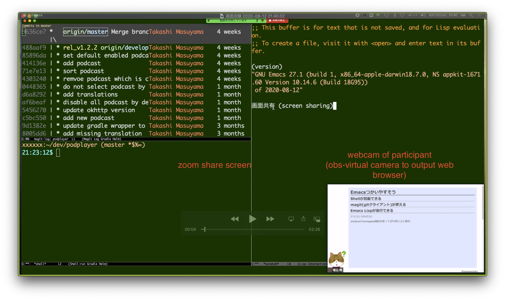
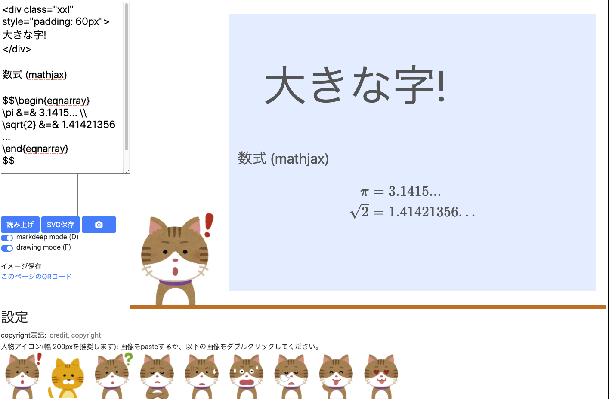
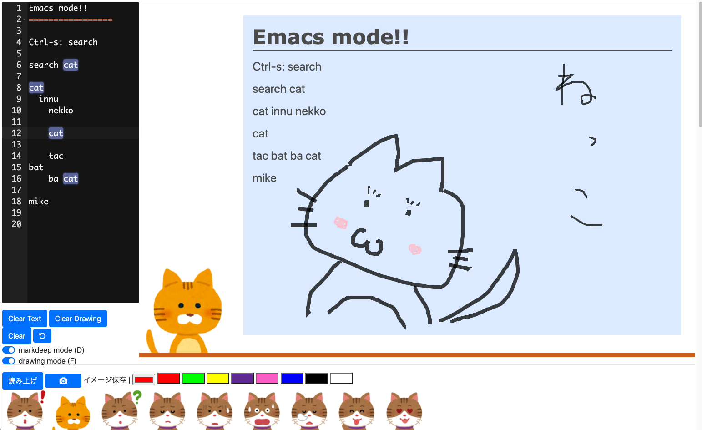
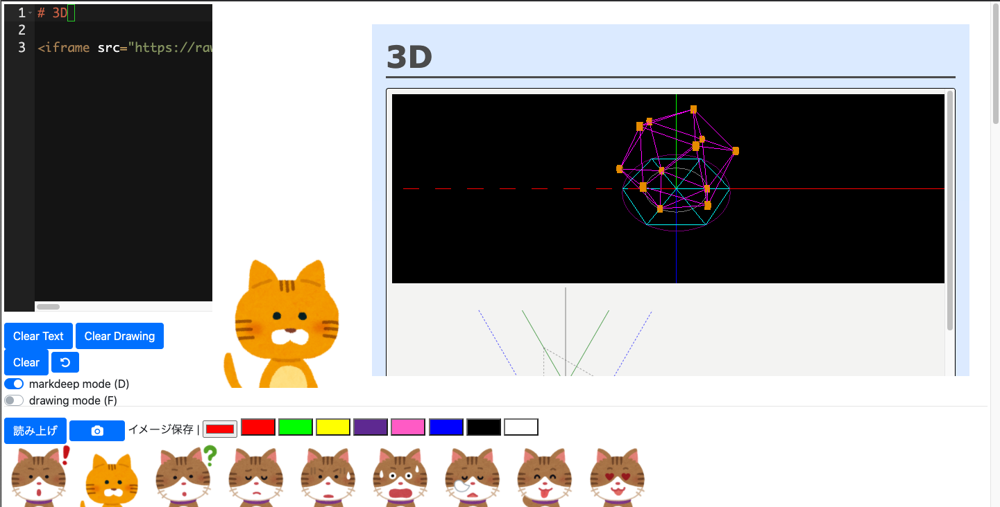
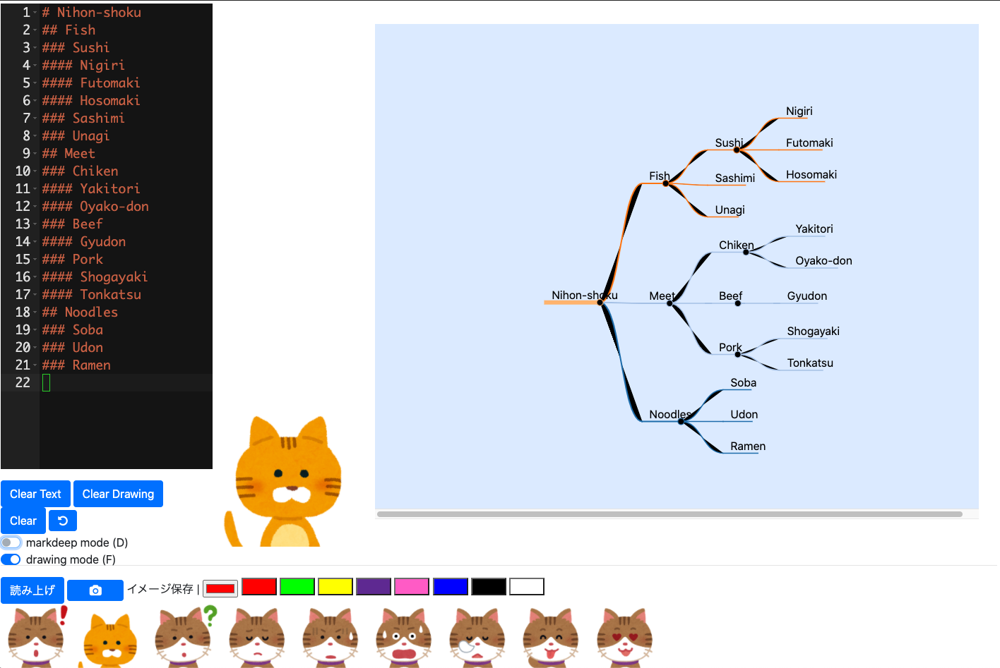

markdeep cam [](https://github.com/mamewotoko/markdeep_cam/actions/workflows/deploy.yml)
==============

Demo
------

* [normal](https://mamewotoko.github.io/markdeep_cam/)
  * 
* [pro](https://mamewotoko.github.io/markdeep_cam/pro.html)
* [3d](https://mamewotoko.github.io/markdeep_cam/3d.html)
* [full](https://mamewotoko.github.io/markdeep_cam/full.html)
* [for smartphone](https://mamewotoko.github.io/markdeep_cam/index2.html)

Content that I want display to virtual camera of remote meeeting like webex, slack and zoom. (with [OBS-studio](https://obsproject.com/ja))

screen to display markdeep (markup language like markdown), mindmap, and svg.







insert other pages with iframe



mindmap mode



* The input markdeeep to right upper textarea.
    * mathjax is supported (i.e. you can write formula with latex syntax)
* A mindmap is drawn from markdeep when markdeep mode switch is disabled.
* You can draw free-hand drawing on the right board.
    * Shift-F toggles svg mode (mouse event is delivered to text behind svg)

Build
-----

install library and compile js (browserify)

```
sh build.sh
```

Example
-------

##  Input1: markdeep_cam


## Input2: video file
  [](https://youtu.be/DnQBxVAb0Hg)

# Output: composed video = Input1 + Input2
* user can enter caption


License
-------

    Copyright (c) 2020-2021 Takashi Masuyama. All rights reserved.

    Licensed under the Apache License, Version 2.0 (the "License");
    you may not use this file except in compliance with the License.
    You may obtain a copy of the License at

       http://www.apache.org/licenses/LICENSE-2.0

    Unless required by applicable law or agreed to in writing, software
    distributed under the License is distributed on an "AS IS" BASIS,
    WITHOUT WARRANTIES OR CONDITIONS OF ANY KIND, either express or implied.
    See the License for the specific language governing permissions and
    limitations under the License.

### Third-party sources

* [dundalek/markmap](https://github.com/dundalek/markmap)
    * mindmap
* [ajaxorg/ace](https://github.com/ajaxorg/ace)
    * editor
* [webrtc/samples](https://github.com/webrtc/samples)

Reference
----------

* [markdeep](https://casual-effects.com/markdeep/)
* [svg_board](https://mamewo.ddo.jp/svg_b/note.html)
* [Bookmarklet OHP](https://mamewo.ddo.jp/bookmarklet_ohp.html)

----
Takashi Masuyama < mamewotoko@gmail.com >

https://mamewo.ddo.jp/
