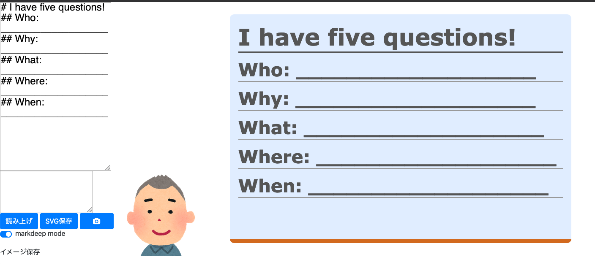

markdeep cam
==============

Content that I want display to virtual camera of remote meeeting like webex, slack and zoom. (with OBS-studio)

screen to display markdeep (markup language like markdown), mindmap, and svg.

* The input markdeeep to right upper textarea.
    * mathjax is supported (i.e. you can write formula with latex syntax)
* A mindmap is drawn from markdeep when markdeep mode switch is disabled.
* You can draw feee hand drawing on the right board. 
    * Shift-F toggles svg mode (mouse event is delivered to text behind svg)

Reference
----------

* [markdeep](https://casual-effects.com/markdeep/)
* [dundalek/markmap](https://github.com/dundalek/markmap)
* [svg_board](https://casual-effects.com/markdeep/)
* [Bookmarklet OHP](https://mamewo.ddo.jp/bookmarklet_ohp.html)

----
Takashi Masuyama < mamewotoko@gmail.com >  

https://mamewo.ddo.jp/
